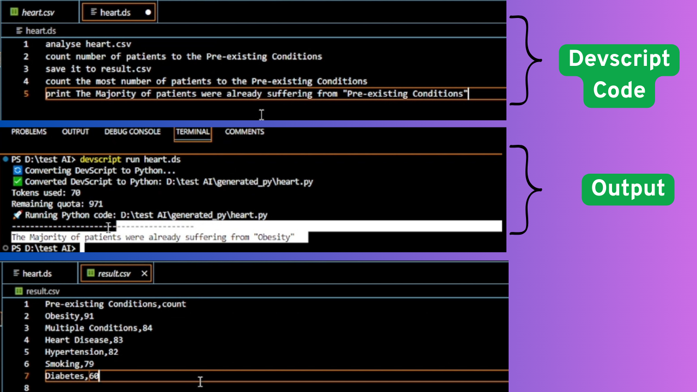

# DevScript
**DevScript** is an AI-powered coding language

---

## Features
- Write code by simply describing the logic — no syntax memorization needed
- Auto-converts your instructions to Python under the hood
- Build full Python programs just by explaining what you want to do
- Perform data analysis and CSV automation with ease — your data stays local and secure
- Works offline with API key–based authentication
- Comes with a simple, no-fuss CLI interface

---

## Installation
DevScript isn't on PyPI yet, so install it from GitHub:
### Option 1: Clone & Install
```
git clone https://github.com/ibedevesh/DevScript.git
cd DevScript
pip install -e .
```
### Option 2: Install Direct from GitHub
```
pip install git+https://github.com/ibedevesh/DevScript.git
```

---

### If you don't have python installed
DevScript requires Python to be installed on your system. Once installed, you can write and run DevScript code from any code editor.
Don't want to install Python locally?
No worries — you can use an online code editor like [Replit](https://replit.com/):
- Go to Replit
- Create a new Python project
- Build full Python programs just by explaining what you want to do
- Start coding in DevScript — it's that simple!

## Setup
After installation, run:
```
devscript setup
```
You'll be asked to enter your API key for authentication. Enter : devscript-test-key-123 for free access

---

## Writing DevScript Files
DevScript files use the `.ds` extension.
### **Example1:**
```
Print Hello DevScript!
```

### **Example2:**
```
analyse accident_prediction_india.csv
plot a pie chart according to the number of accidents to the "Day of Week"
use red color to indicate most number of accidents
save it to week.jpeg
```

### **Example3:**
```
analyse heart.csv
count number of patients to the Pre-existing Conditions
Save this to patients.csv
calculate the most number of patients to the Pre-existing Conditions
print The majority of patients were already suffering from "Pre-existing Conditions"
```


---

## Usage
### Run a DevScript file:
```
devscript run hello.ds
```
### Exaplain error in natural language:
```
devscript explain
```
### Convert to Python:
```
devscript convert hello.ds
```
Python code is saved in the `generated_py` folder.
### Convert and Run:
```
devscript convert hello.ds --run
```
### Check API usage:
```
devscript usage
```

---

## Troubleshooting
**API Key Issues:**
- Make sure you've run `devscript setup`
- Check API status: `devscript usage`
- Config is stored in: `~/.devscript/config.json`

**Connection Issues:**
- Check internet connection  
- Ensure nothing is blocking the network  
- Debug with:
```
DEVSCRIPT_DEBUG=1 devscript run file.ds
```

---

### Uninstall DevScript
```
pip uninstall devscript-client
```

## License
Licensed under the MIT License. See LICENSE file.

---

## Created by Devesh
DevScript is in early access. Be part of the journey. 🚀 If you want DevScript for your business with high usage, mail me at: deveshdv760@gmail.com, I will be happy to help you.

---
